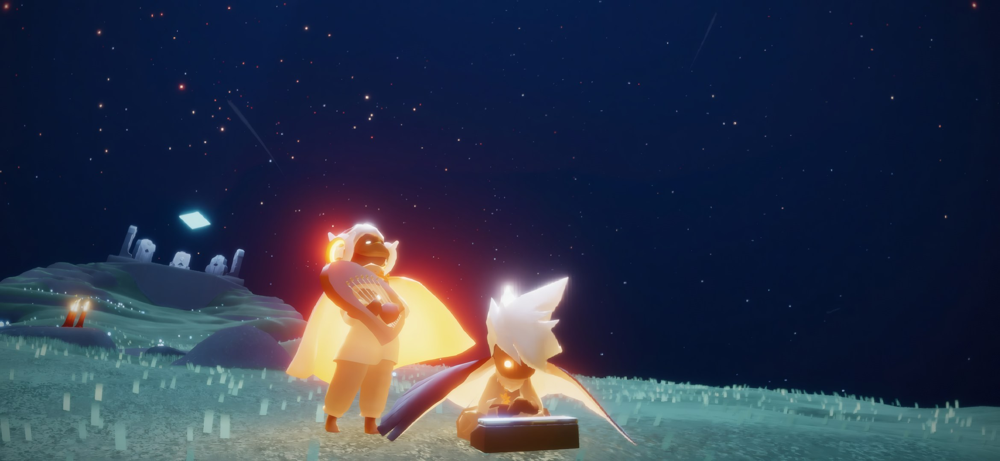

<!-- LTeX: language=es-ES -->

<div align="center">

  

# [Sky1984 Sheets Collection](https://api.github.com/repos/Ai-Vonie/Sky1984-Sheets-Collection)

🌍 Leer en: _[English (en-US)](README.md) ∙_ **⮞⮞ Español (es-ES) ⮜⮜** _∙
[Русский (ru-RU)](README_ru-RU.md)_

</div>

**Sky1984 Sheets Collection** es una extensa biblioteca de partituras musicales recopiladas para
simplificar la búsqueda de composiciones específicas en un solo lugar. Estas partituras están
diseñadas para tocarse en los instrumentos dentro del juego **Sky: Children of the Light** y para su
uso en el sitio web _[Sky Music Nightly](https://sky-music-nightly.pages.dev/)_. Las partituras
musicales se encuentran en tres carpetas principales ([**Multi-Sheet Songs**](Multi-Sheet%20Songs),
[**Songs**](Songs) y [**VSRG**](VSRG)), donde están ordenadas alfabéticamente.

> [!WARNING]
>
> ⚠️ **¡Atención!** Esta colección no está completa ni es definitiva. Se recomienda consultar otras
> fuentes y bibliotecas para obtener actualizaciones, ya que el contenido de este repositorio podría
> estar desactualizado o ser irrelevante en comparación con ellas.

<details open>
<summary><b>📋 Tabla de contenidos</b></summary>

---

- [Sky1984 Sheets Collection](#sky1984-sheets-collection)
  - [🔍 Cómo buscar correctamente las partituras](#-cómo-buscar-correctamente-las-partituras)
  - [💾 Cómo descargar](#-cómo-descargar)
    - [1. Descargar un archivo individual](#1-descargar-un-archivo-individual)
    - [2. Descargar una carpeta específica](#2-descargar-una-carpeta-específica)
    - [3. Descargar todo el repositorio](#3-descargar-todo-el-repositorio)
    - [4. Descargar archivos desde las versiones (releases)](#4-descargar-archivos-desde-las-versiones-releases)
  - [🎹 Convertidor de MIDI a partitura de Sky](#-convertidor-de-midi-a-partitura-de-sky)
    - [📝 Recomendaciones de uso](#-recomendaciones-de-uso)
  - [💭 ¿Por qué?](#-por-qué)
  - [⚙️ Detalles técnicos](#️-detalles-técnicos)
  - [⚖️ Aspectos legales y derechos de autor](#️-aspectos-legales-y-derechos-de-autor)
    - [Repositorio](#repositorio)
    - [Colección de partituras](#colección-de-partituras)

---

</details>

## 🔍 Cómo buscar correctamente las partituras

Para una búsqueda efectiva de la composición deseada, intenta seguir estas recomendaciones:

- **Usa palabras clave:** Ingresa solo las palabras clave o la parte significativa del título de la
  canción, y también intenta buscar por separado el apodo del autor.
- **Evita el desorden:** Excluye **palabras vacías** (artículos, conjunciones, preposiciones) y
  símbolos específicos de tu consulta.
- **Buscar en una carpeta específica:** usa la sintaxis especial
  [**`path:/^Songs\//`**](https://github.com/search?q=repo%3AAi-Vonie%2FSky1984-Sheets-Collection%20path%3A%2F%5ESongs%5C%2F%2F%20&type=code)
  al principio de tu consulta de búsqueda para limitar la búsqueda a una carpeta específica.

La búsqueda del repositorio funciona en dos modos:

1. **[Por nombre de archivo](https://docs.github.com/search-github/searching-on-github/finding-files-on-github)**
   — presiona `t` o haz clic en el botón **`Go to file`** para iniciar la búsqueda en el menú de
   salto rápido a archivos.
2. **[Por contenido de archivo](https://docs.github.com/search-github/github-code-search/using-github-code-search)**
   — presiona `/` o haz clic en el campo de búsqueda encima de **`Type / to search`** para activar
   [búsqueda global de código en este repositorio](https://github.com/search?q=repo%3AAi-Vonie%2FSky1984-Sheets-Collection%20&type=code).

> [!IMPORTANT]
>
> ‼️ **Importante:** Para utilizar la búsqueda de código (contenido de archivos), debes **iniciar
> sesión en tu cuenta de GitHub**.

Se recomienda leer la documentación sobre
[limitaciones de la búsqueda de código](https://docs.github.com/search-github/github-code-search/about-github-code-search#limitations)
y
[sintaxis especial de consultas](https://docs.github.com/search-github/github-code-search/understanding-github-code-search-syntax)
para comprender las capacidades y limitaciones técnicas.

## 💾 Cómo descargar&nbsp;[](https://github.com/Ai-Vonie/Sky1984-Sheets-Collection/releases/latest)

Puedes descargar archivos individuales, carpetas específicas o todo el repositorio de una vez.

### 1. Descargar un archivo individual

Ve a la página del archivo deseado y elige un método conveniente:

- **Descargar archivo:** Haz clic en el ícono **`Download raw file`** en la esquina superior derecha
  encima del código del archivo.
- **Copiar contenido:** Haz clic en el ícono **`Copy raw file`** para copiar el texto al
  portapapeles.
- **Vía Raw:** Haz clic en el botón **`Raw`**, luego presiona `Ctrl + S` (Windows) o `Cmd + S`
  (macOS) para guardar el archivo.

### 2. Descargar una carpeta específica

GitHub no permite descargar carpetas individuales de forma predeterminada. Usa
[Download Directory](https://github.com/download-directory/download-directory.github.io) para esto:

1. Abre la carpeta deseada en este repositorio.
2. Copia el enlace (URL) de la barra de direcciones del navegador.
3. Ve a [download-directory.github.io](https://download-directory.github.io/)
   (`https://download-directory.github.io/`).
4. Pega el enlace en el campo de entrada y presiona `Enter`. La carpeta se descargará como un
   archivo ZIP.

### 3. Descargar todo el repositorio

Para obtener una copia local completa de la biblioteca:

1. Ve a la página principal del repositorio.
2. Haz clic en el botón verde **`<> Code`**.
3. Selecciona
   [**`Download ZIP`**](https://github.com/Ai-Vonie/Sky1984-Sheets-Collection/archive/refs/heads/master.zip)
   en el menú desplegable.

### 4. Descargar archivos desde las versiones (releases)

También puedes descargar una carpeta específica o todo el repositorio como un archivo en la
[última versión publicada](https://github.com/Ai-Vonie/Sky1984-Sheets-Collection/releases/latest)
desde la pestaña [**Releases**](https://github.com/Ai-Vonie/Sky1984-Sheets-Collection/releases).

> Los archivos en las versiones utilizan un algoritmo de compresión especializado con
> configuraciones optimizadas para la estructura de estos archivos para garantizar el tamaño más
> pequeño posible.

## 🎹 Convertidor de MIDI a partitura de Sky&nbsp;[](https://colab.research.google.com/drive/1Kia0VrRyctLVs1q0lYKJVnGpW45U7_EQ?usp=sharing)

Si deseas crear una partitura musical para Sky desde un archivo MIDI, puedes intentar usar la
[herramienta de conversión especializada](https://colab.research.google.com/drive/1Kia0VrRyctLVs1q0lYKJVnGpW45U7_EQ?usp=sharing)
vinculada a continuación:

```plaintext
https://colab.research.google.com/drive/1Kia0VrRyctLVs1q0lYKJVnGpW45U7_EQ?usp=sharing
```

> [!WARNING]
>
> ⚠️ **¡Advertencia!** Esta herramienta de trasposición MIDI opera con un algoritmo simplificado y
> no utiliza ninguna biblioteca avanzada de terceros para análisis musical profundo. Se recomienda
> usar otras herramientas especializadas de trasposición MIDI, ya que este convertidor puede ser
> imperfecto o menos funcional en comparación con alternativas profesionales.

Puedes encontrar ejemplos de conversiones decentes realizadas con este script en el servidor de
Discord **[SkyAutoMusic](https://discord.gg/wzjWKyJtmk)** (**`https://discord.gg/wzjWKyJtmk`**)
mediante los enlaces a continuación:

<details open>
<summary><b>👀 Tabla de ejemplos de conversión</b></summary>

---

<!-- LTeX: enabled=false -->

| Composición                                                                                                           |             Enlace al archivo              |  Descargar archivo  |
| :-------------------------------------------------------------------------------------------------------------------- | :----------------------------------------: | :-----------------: |
| [🎹][ms_01] [_My Dearest - supercell Guilty Crown OP1 + Animenz's 10th Anniversary_][yt_01]                           | [💬 Discord][msg_01]<br>[🐱 GitHub][gh_01] | [💾 Discord][dl_01] |
| [🎹][ms_02] [_Oppenheimer Can You Hear the Music - Music by Ludwig Göransson Arrangement by Akmigone_][yt_02]         | [💬 Discord][msg_02]<br>[🐱 GitHub][gh_02] | [💾 Discord][dl_02] |
| [🎹][ms_03] _Kawaki wo Ameku - Domestic Girlfriend OP_                                                                | [💬 Discord][msg_03]<br>[🐱 GitHub][gh_03] | [💾 Discord][dl_03] |
| [🎹][ms_04] _Freedom DiVE (Full) - xi_                                                                                | [💬 Discord][msg_04]<br>[🐱 GitHub][gh_04] | [💾 Discord][dl_04] |
| [🎹][ms_05] [_Tokyo Ghoul - Licht und Schatten (Akmigone)_][yt_05]                                                    | [💬 Discord][msg_05]<br>[🐱 GitHub][gh_05] | [💾 Discord][dl_05] |
| [🎹][ms_06] [_Interstellar Main Theme – Hans Zimmer - Arrangement by Peter Buka_][yt_06]                              | [💬 Discord][msg_06]<br>[🐱 GitHub][gh_06] | [💾 Discord][dl_06] |
| [🎹][ms_07] _Interstellar_                                                                                            | [💬 Discord][msg_07]<br>[🐱 GitHub][gh_07] | [💾 Discord][dl_07] |
| [🎹][ms_08] [_in the pool - Chainsaw Man Reze Arc OST – Music by Kensuke Ushio Arrangement by Animenz_][yt_08]        | [💬 Discord][msg_08]<br>[🐱 GitHub][gh_08] | [💾 Discord][dl_08] |
| [🎹][ms_09] [_One Last Kiss - Evangelion 3.0 + 1.0 Theme Song – Music by Hikaru Utada Arrangement by Animenz_][yt_09] | [💬 Discord][msg_09]<br>[🐱 GitHub][gh_09] | [💾 Discord][dl_09] |
| [🎹][ms_10] _Ghost Rule - DECO 27 ft. Hatsune Miku.HatsuneMiku_                                                       | [💬 Discord][msg_10]<br>[🐱 GitHub][gh_10] | [💾 Discord][dl_10] |
| [🎹][ms_11] _Sekai Wa Koi Ni Ochiteiru - Ao Haru Ride OP_                                                             | [💬 Discord][msg_11]<br>[🐱 GitHub][gh_11] | [💾 Discord][dl_11] |
| [🎹][ms_12] [_Microchip – Music by Patrik Pietschmann_][yt_12]                                                        | [💬 Discord][msg_12]<br>[🐱 GitHub][gh_12] | [💾 Discord][dl_12] |
| [🎹][ms_13] [_Kamado Tanjiro no Uta - Go Shiina feat. Nami Nakagawa (The title is too long)_][yt_13]                  | [💬 Discord][msg_13]<br>[🐱 GitHub][gh_13] | [💾 Discord][dl_13] |
| [🎹][ms_14] _Night of Nights - COOL&CREATE Marasy8_                                                                   | [💬 Discord][msg_14]<br>[🐱 GitHub][gh_14] | [💾 Discord][dl_14] |
| [🎹][ms_15] [_ナイト・オブ・ナイツ 2020 (marasy arr.)_][yt_15]                                                        | [💬 Discord][msg_15]<br>[🐱 GitHub][gh_15] | [💾 Discord][dl_15] |
| [🎹][ms_16] _Touhou Boss Rush!! (I)_                                                                                  | [💬 Discord][msg_16]<br>[🐱 GitHub][gh_16] | [💾 Discord][dl_16] |

<!-- Reference links for MIDI conversion examples -->

[ms_01]: https://musescore.com/user/64980103/scores/13568578
[yt_01]: https://www.youtube.com/watch?v=lAXJPop9LaY
[msg_01]: https://discord.com/channels/735827593710010369/798936282449182741/1458087590593958000
[gh_01]:
  https://github.com/Ai-Vonie/Sky1984-Sheets-Collection/blob/v26.01.08-v1.2.0/Songs/M/My%20Dearest%20-%20supercell%20Guilty%20Crown%20OP1%20+%20Animenz's%2010th%20Anniversary.txt
[dl_01]:
  https://fixcdn.hyonsu.com/attachments/798936282449182741/1458087590635896988/My_Dearest_-_supercell_Guilty_Crown_OP1__Animenzs_10th_Anniversary.txt

<!-- -->

[ms_02]: https://musescore.com/user/81591427/scores/23161579
[yt_02]: https://www.youtube.com/watch?v=3jBtnMUlIzo
[msg_02]: https://discord.com/channels/735827593710010369/798936282449182741/1457687970420097221
[gh_02]:
  https://github.com/Ai-Vonie/Sky1984-Sheets-Collection/blob/v26.01.08-v1.2.0/Songs/O/Oppenheimer%20Can%20You%20Hear%20the%20Music%20-%20Music%20by%20Ludwig%20Göransson%20Arrangement%20by%20Akmigone.txt
[dl_02]:
  https://fixcdn.hyonsu.com/attachments/798936282449182741/1457687970881736836/Oppenheimer_Can_You_Hear_the_Music_-_Music_by_Ludwig_Goransson_Arrangement_by_Akmigone.txt

<!-- -->

[ms_03]: https://musescore.com/user/2050876/scores/5981746
[msg_03]: https://discord.com/channels/735827593710010369/798936282449182741/1460664377920454832
[gh_03]:
  https://github.com/Ai-Vonie/Sky1984-Sheets-Collection/blob/v26.01.14-v1.2.2/Songs/K/Kawaki%20wo%20Ameku%20-%20Domestic%20Girlfriend%20OP.txt
[dl_03]:
  https://fixcdn.hyonsu.com/attachments/798936282449182741/1460664374094987469/Kawaki_wo_Ameku_-_Domestic_Girlfriend_OP.txt

<!-- -->

[ms_04]: https://musescore.com/user/16423076/scores/6251635
[msg_04]: https://discord.com/channels/735827593710010369/798936282449182741/1460584833871777987
[gh_04]:
  https://github.com/Ai-Vonie/Sky1984-Sheets-Collection/blob/v26.01.14-v1.2.2/Songs/F/Freedom%20DiVE%20(Full)%20-%20xi.txt
[dl_04]:
  https://fixcdn.hyonsu.com/attachments/798936282449182741/1460584833544753310/Freedom_DiVE_Full_-_xi.txt

<!-- -->

[ms_05]: https://musescore.com/user/1176981/scores/3319216
[yt_05]: https://www.youtube.com/watch?v=O8s4OcRJc3w
[msg_05]: https://discord.com/channels/735827593710010369/798936282449182741/1458503196497547401
[gh_05]:
  https://github.com/Ai-Vonie/Sky1984-Sheets-Collection/blob/v26.01.08-v1.2.0/Songs/T/Tokyo%20Ghoul%20-%20Licht%20und%20Schatten%20(Akmigone).txt
[dl_05]:
  https://fixcdn.hyonsu.com/attachments/798936282449182741/1458503194098270322/Tokyo_Ghoul_-_Licht_und_Schatten_Akmigone.txt

<!-- -->

[ms_06]: https://musescore.com/user/81591427/scores/20997538
[yt_06]: https://www.youtube.com/watch?v=BTBPAmcoZZA
[msg_06]: https://discord.com/channels/735827593710010369/798936282449182741/1458503196497547401
[gh_06]:
  https://github.com/Ai-Vonie/Sky1984-Sheets-Collection/blob/v26.01.08-v1.2.0/Songs/I/Interstellar%20Main%20Theme%20–%20Hans%20Zimmer%20-%20Arrangement%20by%20Peter%20Buka.txt
[dl_06]:
  https://fixcdn.hyonsu.com/attachments/798936282449182741/1458503196241690668/Interstellar_Main_Theme_Hans_Zimmer_-_Arrangement_by_Peter_Buka.txt

<!-- -->

[ms_07]: https://musescore.com/user/18619471/scores/5124259
[msg_07]: https://discord.com/channels/735827593710010369/798936282449182741/1457681743531474987
[gh_07]:
  https://github.com/Ai-Vonie/Sky1984-Sheets-Collection/blob/v26.01.08-v1.2.0/Songs/I/Interstellar%20_~%7B%5B%23v3%5D%7D~_.txt
[dl_07]:
  https://fixcdn.hyonsu.com/attachments/798936282449182741/1457681741136396401/Interstellar.txt

<!-- -->

[ms_08]: https://musescore.com/user/81591427/scores/28992002
[yt_08]: https://www.youtube.com/watch?v=1X8Jqn_TMzs
[msg_08]: https://discord.com/channels/735827593710010369/798936282449182741/1458503196497547401
[gh_08]:
  https://github.com/Ai-Vonie/Sky1984-Sheets-Collection/blob/v26.01.08-v1.2.0/Songs/I/in%20the%20pool%20-%20Chainsaw%20Man%20Reze%20Arc%20OST%20–%20Music%20by%20Kensuke%20Ushio%20Arrangement%20by%20Animenz.txt
[dl_08]:
  https://fixcdn.hyonsu.com/attachments/798936282449182741/1458503195541246188/in_the_pool_-_Chainsaw_Man_Reze_Arc_OST_Music_by_Kensuke_Ushio_Arrangement_by_Animenz.txt

<!-- -->

[ms_09]: https://musescore.com/user/81591427/scores/27140323
[yt_09]: https://www.youtube.com/watch?v=m4DF7mAgMoI
[msg_09]: https://discord.com/channels/735827593710010369/798936282449182741/1458779446793211935
[gh_09]:
  https://github.com/Ai-Vonie/Sky1984-Sheets-Collection/blob/v26.01.08-v1.2.0/Songs/O/One%20Last%20Kiss%20-%20Evangelion%203.0%20%2B%201.0%20Theme%20Song%20–%20Music%20by%20Hikaru%20Utada%20Arrangement%20by%20Animenz.txt
[dl_09]:
  https://fixcdn.hyonsu.com/attachments/798936282449182741/1458779446915108992/One_Last_Kiss_-_Evangelion_3.0__1.0_Theme_Song_Music_by_Hikaru_Utada_Arrangement_by_Animenz.txt

<!-- -->

[ms_10]: https://musescore.com/user/2050876/scores/7554869
[msg_10]: https://discord.com/channels/735827593710010369/798936282449182741/1460664377920454832
[gh_10]:
  https://github.com/Ai-Vonie/Sky1984-Sheets-Collection/blob/v26.01.14-v1.2.2/Songs/G/Ghost%20Rule%20-%20DECO%2027%20ft.%20Hatsune%20Miku.HatsuneMiku.txt
[dl_10]:
  https://fixcdn.hyonsu.com/attachments/798936282449182741/1460664375743352977/Ghost_Rule_-_DECO_27_ft._Hatsune_Miku.HatsuneMiku.txt

<!-- -->

[ms_11]: https://musescore.com/user/2050876/scores/5006566
[msg_11]: https://discord.com/channels/735827593710010369/798936282449182741/1460664377920454832
[gh_11]:
  https://github.com/Ai-Vonie/Sky1984-Sheets-Collection/blob/v26.01.14-v1.2.2/Songs/S/Sekai%20Wa%20Koi%20Ni%20Ochiteiru%20-%20Ao%20Haru%20Ride%20OP.txt
[dl_11]:
  https://fixcdn.hyonsu.com/attachments/798936282449182741/1460664376703848681/Sekai_Wa_Koi_Ni_Ochiteiru_-_Ao_Haru_Ride_OP.txt

<!-- -->

[ms_12]: https://musescore.com/user/81591427/scores/19218685
[yt_12]: https://www.youtube.com/watch?v=jC79M6HFOOE
[msg_12]: https://discord.com/channels/735827593710010369/798936282449182741/1458503196497547401
[gh_12]:
  https://github.com/Ai-Vonie/Sky1984-Sheets-Collection/blob/v26.01.08-v1.2.0/Songs/M/Microchip%20–%20Music%20by%20Patrik%20Pietschmann.txt
[dl_12]:
  https://fixcdn.hyonsu.com/attachments/798936282449182741/1458503195864334448/Microchip_Music_by_Patrik_Pietschmann.txt

<!-- -->

[ms_13]: https://musescore.com/user/64980103/scores/13530823
[yt_13]: https://www.youtube.com/watch?v=-jzET1Fe3oo
[msg_13]: https://discord.com/channels/735827593710010369/798936282449182741/1457632458081177833
[gh_13]:
  https://github.com/Ai-Vonie/Sky1984-Sheets-Collection/blob/v26.01.08-v1.2.0/Songs/K/Kamado%20Tanjiro%20no%20Uta%20-%20Go%20Shiina%20feat.%20Nami%20Nakagawa%20(The%20title%20is%20too%20long).txt
[dl_13]:
  https://fixcdn.hyonsu.com/attachments/798936282449182741/1457632457196306442/Kamado_Tanjiro_no_Uta_-_Go_Shiina_feat._Nami_Nakagawa_The_title_is_too_long.txt

<!-- -->

[ms_14]: https://musescore.com/user/38235231/scores/6338677
[msg_14]: https://discord.com/channels/735827593710010369/798936282449182741/1458510115714891849
[gh_14]:
  https://github.com/Ai-Vonie/Sky1984-Sheets-Collection/blob/v26.01.08-v1.2.0/Songs/N/Night%20of%20Nights%20-%20COOL%26CREATE%20Marasy8.txt
[dl_14]:
  https://fixcdn.hyonsu.com/attachments/798936282449182741/1458510114658189505/Night_of_Nights_-_COOLCREATE_Marasy8.txt

<!-- -->

[ms_15]: https://musescore.com/user/6480061/scores/6443683
[yt_15]: https://www.youtube.com/watch?v=OixrgxwNGyg
[msg_15]: https://discord.com/channels/735827593710010369/798936282449182741/1457447445897281758
[gh_15]:
  https://github.com/Ai-Vonie/Sky1984-Sheets-Collection/blob/v26.01.08-v1.2.0/Songs/Japanese/ナイト・オブ・ナイツ%202020%20(marasy%20arr.).txt
[dl_15]:
  https://fixcdn.hyonsu.com/attachments/798936282449182741/1457447446333624403/2020_marasy_arr..txt

<!-- -->

[ms_16]: https://musescore.com/user/29625/scores/5935037
[msg_16]: https://discord.com/channels/735827593710010369/798936282449182741/1458211093712207964
[gh_16]:
  https://github.com/Ai-Vonie/Sky1984-Sheets-Collection/blob/v26.01.08-v1.2.0/Songs/T/Touhou%20Boss%20Rush!!%20(I).txt
[dl_16]:
  https://fixcdn.hyonsu.com/attachments/798936282449182741/1458211093431193700/Touhou_Boss_Rush_I.txt

<!-- -->

<!-- End of reference links -->

<!-- LTeX: enabled=true -->

---

</details>

> [!NOTE]
>
> ℹ️ **Nota:** Se pueden encontrar otros ejemplos de conversión en el historial del canal revisando
> mensajes cerca de los enlaces proporcionados arriba (alrededor de las mismas fechas).

### 📝 Recomendaciones de uso

Para obtener los mejores resultados, sigue estos pasos recomendados:

0. **Dónde encontrar archivos MIDI:** Hay muchas formas de buscar o generar archivos MIDI, pero la
   opción más sencilla es revisar el repositorio
   **[dl-librescore](https://github.com/LibreScore/dl-librescore)** para el sitio
   **[MuseScore](https://musescore.com/)**.
1. **Selección de la fuente:** Usa archivos MIDI con una estructura clara (por ejemplo, versiones de
   _Solo de Piano_); evita archivos orquestales con docenas de pistas.
2. **Nombrado de archivos:** Antes de convertir, renombra el archivo MIDI con el título como quieres
   que aparezca la canción.
   - El script usa el nombre del archivo para completar el campo interno `"name"` de la partitura.
   - Se recomienda eliminar partes innecesarias del nombre del archivo (por ejemplo, _[Solo de
     Piano]_, _«Synthesia»_, etc.) de antemano. Si se te olvida hacerlo, puedes editar manualmente
     el campo `"name"` dentro del archivo JSON más tarde.
3. **Verificación de resultados:** Para escuchar y verificar la partitura resultante, usa el
   **_Compositor_** en el sitio _[Sky Music Nightly](https://sky-music.specy.app/composer)_, ya que
   la herramienta genera partituras JSON específicamente válidas para este sitio.
4. **Edición y pulido:** En la configuración del _Compositor_, perfecciona la partitura hasta la
   _perfección_:
   - Ajusta **la afinación (Pitch)** y/o cambia el **Instrumento**.
   - Para un sonido más atmosférico, habilita el eco ajustando el parámetro **Reverberación base
     (Base Reverb)**.
   - Corrige manualmente áreas "defectuosas" como **glisandos** y **arpegios**. Es mejor trasponer,
     delgacear o redibujar estos momentos manualmente.
5. **Corrección de velocidad:** Si el modo automático (`Auto_Scroll`) seleccionó un multiplicador de
   BPM incorrecto y la duración total difiere de la original en 10–20 segundos o más, intenta
   regenerar el archivo con `Auto_Scroll` desactivado y selecciona el valor manualmente a través del
   parámetro `Manual_Multiplier`.

> [!NOTE]
>
> ℹ️ **Nota:** Si el archivo MIDI seleccionado contiene una cantidad muy grande de notas (decenas de
> miles), el proceso de conversión puede tardar de uno a varios minutos.

<!-- -->

> [!TIP]
>
> **📢 ¡Comparte el resultado!** No olvides compartir el archivo de partitura convertido con otros
> en el servidor de Discord **[SkyAutoMusic](https://discord.gg/wzjWKyJtmk)**
> (**`https://discord.gg/wzjWKyJtmk`**) en el canal
> [**🎹 music / 🎶share-songs**](https://discord.com/channels/735827593710010369/798936282449182741).

<p align="right">
  <a href="#sky1984-sheets-collection">↑ Volver al inicio</a>
</p>

---

## 💭 ¿Por qué?

La idea de crear esta colección surgió hace dos años, pero en ese momento me cambié a otros juegos,
donde también continué mi camino como bardo musical.

Cuando tuve algo de tiempo libre en FF XIV, decidí simplemente hacerlo, porque las alternativas
existentes y otras opciones de bibliotecas no me satisfacían con su implementación o enfoque
organizativo para usar estas partituras en otros juegos. El repositorio en sí se ensambló en un par
de noches.

## ⚙️ Detalles técnicos

Inicialmente, se recopilaron ±59.457 archivos. La colección final es el resultado donde se
eliminaron los duplicados, y se conservaron los archivos con el contenido interno y nombre de
archivo más "de calidad".

Se utilizó un algoritmo personalizado para filtrar duplicados con la siguiente lógica:

1. **Duplicados exactos:** Comparación por hash SHA-256 del archivo.
2. **Duplicados estructurales:** Análisis del contenido de los metadatos JSON.
3. **Variantes de capa exactas:** Comparación de firmas exactas de notas para identificar
   variaciones de clave diferentes de la misma partitura.
4. **Variantes de capa difusas:** Comparación de firmas de notas para identificar variaciones de
   clave diferentes con ligeras desviaciones (con un umbral de similitud de ~97%).
5. **Coincidencia de contenido difusa:** Comparación de secuencias completas de notas dentro del
   mismo grupo de BPM para identificar arreglos similares (con un umbral de similitud de ~80%).

> [!NOTE]
>
> ℹ️ **Nota:** Se permitió la inclusión de algunos archivos en el repositorio si se encontraron
> variaciones de canciones (por ejemplo, _Fácil/Difícil_, _V1/V2_, _Partituras múltiples/Solo_ y
> otras opciones posibles).

## ⚖️ Aspectos legales y derechos de autor

### Repositorio

El código, scripts y herramientas creadas para este repositorio están licenciadas bajo
[**WTFPL**](LICENSE).

### Colección de partituras

La curación de la colección y los formatos de archivos convertidos (JSON/TXT) se dedican al dominio
público bajo [**The Unlicense**](LICENSE).

El propietario del repositorio **renuncia a todos los derechos** sobre la compilación en sí. Sin
embargo, tenga en cuenta:

- **Composiciones originales:** Todos los derechos pertenecen a sus respectivos compositores,
  editores y titulares de derechos de autor.
- **Transcripciones:** Los derechos de los arreglos musicales específicos pertenecen a los autores
  originales que crearon los archivos MIDI/Partituras.

Esta colección se proporciona estrictamente con fines **de archivo**.
